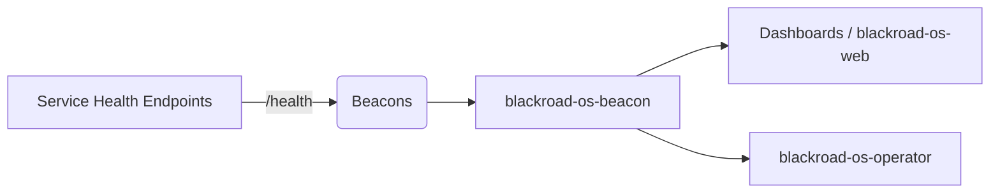

# Beacon Overview

`blackroad-os-beacon` acts as the heartbeat service for BlackRoad OS. It polls service health endpoints, normalizes them into the SIG beacon shape, and retains a lightweight deploy history so operators and dashboards can correlate deploys with availability.

## Heartbeat flow

### Metadata
- **agent_id**: the beacon agent emitting the record (this service).
- **ps_sha_infinity**: propagated pseudo-SHA used across agents (`pssha∞:br:<agent_id>:<hash>`).

### What it delivers
- Beacon snapshots for each configured service.
- Deploy log append-only feed with quick filtering.
- Simple HTTP API for dashboards and operators.
